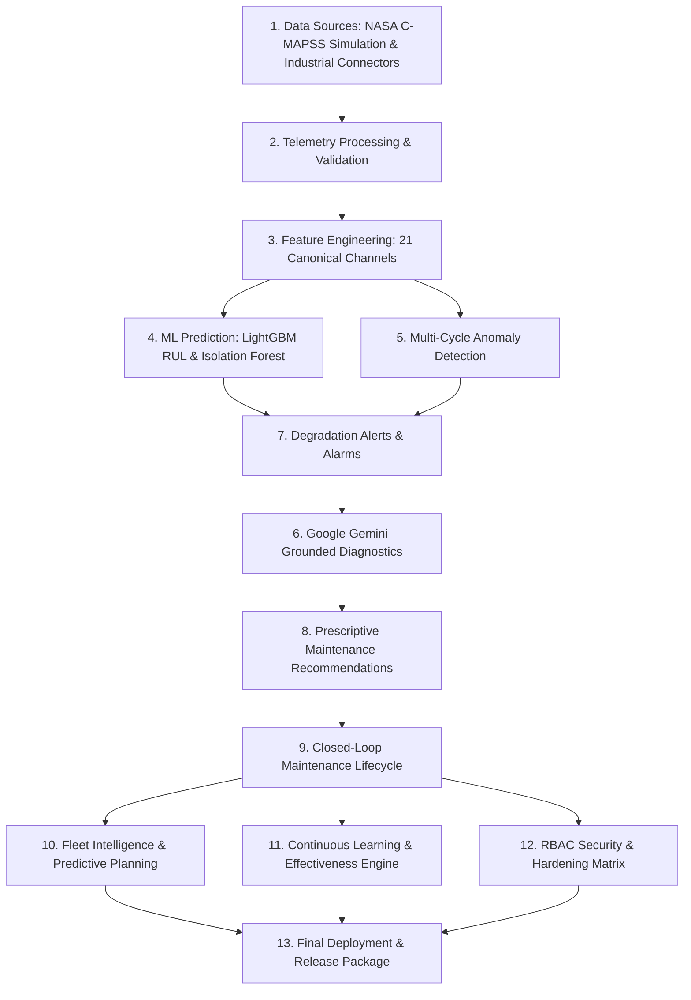

# FactoryMind AI — Enterprise Turbofan Prognostics & Industrial Intelligence Platform

```
MONITOR → PREDICT → DIAGNOSE → PRIORITIZE → PLAN → EXECUTE → VERIFY → LEARN → SECURE → RELEASE
```

FactoryMind AI is a production-grade, closed-loop industrial AI platform for real-time turbofan engine health monitoring, predictive remaining useful life (RUL) estimation, Google Gemini grounded root-cause diagnostics, prescriptive maintenance execution, fleet-wide risk planning, and empirical continuous learning.

---

## 1. Architectural Blueprint (13 Core Systems)



### 1. Data Sources & Transparency Contract
- **Baseline Demonstration Source**: `NASA C-MAPSS FD001 — Simulation` (100 Turbofan Engines, 21 sensor channels, 3 operational settings, up to 362 run-to-failure cycles).
- **Industrial Connectors**: REST API connector, MQTT / IoT connector, and validated CSV file ingestion.
- **Truthful Labeling Contract**:
  - Simulation telemetry is explicitly labeled `"NASA C-MAPSS FD001 — Simulation"`.
  - When factory connectors are not connected, the UI displays `"Real Industrial Data: Not Configured"`.

### 2. Telemetry Ingestion & Stream Processing
- Ingests 21 normalized sensor channels per operating cycle with strict validation against physical turbofan sensor ranges.
- Flags out-of-range sensor readings as `UNAVAILABLE` or `DATA_QUALITY: STALE` without guessing.

### 3. Feature Engineering & Schema Compatibility
- Validates 21-channel canonical taxonomy ($s_1 \dots s_{21}$).
- Enforces strict ML compatibility: if incoming telemetry has $<21$ compatible channels, marks ML output as `INCOMPATIBLE` and displays `RUL: UNAVAILABLE`.

### 4. ML Prediction & Prognostics
- **RUL Prognostic Model**: LightGBM Regressor trained on NASA C-MAPSS FD001 failure trajectories.
- **Anomaly Detection**: Scikit-Learn Isolation Forest scoring multi-dimensional sensor deviations.
- **Composite Health Index**: Deterministic formula combining RUL and anomaly score.

### 5. Multi-Cycle Anomaly Detection
- Multi-cycle persistence filter (hysteresis buffer) preventing transient noise from triggering false alarms.
- High-severity override for critical safety parameter violations.

### 6. Gemini Grounded Root-Cause Analysis (RCA)
- Generates evidence-grounded engineering explanations with Google Gemini 3.6 Flash.
- Validates that returned JSON references strictly observed telemetry parameters.
- Deterministic rule-based fallback guarantees continuity if external GenAI API is unavailable.

### 7. Degradation Alerts & Alarms Ledger
- Persistent ledger recording threshold breaches, severity (`CRITICAL`, `HIGH`, `MEDIUM`), and empirical evidence.
- Full operator acknowledgment lifecycle.

### 8. Prescriptive Maintenance Recommendations
- Actionable directives linked to specific turbofan subsystems (HPC, LPT, HPT, Combustor, Fan Module, Bleed Air).

### 9. Closed-Loop Maintenance Lifecycle (Stage 8)
- Strict 5-stage lifecycle state machine:
  $$\text{OPEN} \rightarrow \text{ASSIGNED} \rightarrow \text{IN_PROGRESS} \rightarrow \text{VERIFICATION\_REQUIRED} \rightarrow \text{VERIFIED}$$
- Invalid state jumps return `HTTP 422 Unprocessable Entity`.
- Once an order is `VERIFIED`, it is **locked and permanently immutable**.

### 10. Fleet Intelligence & Predictive Planning (Stage 9)
- Aggregates genuine machine records, alerts, and work orders.
- Read-only decision support planner categorizing machines without automatically creating fake work orders.

### 11. Continuous Learning & Maintenance Effectiveness (Stage 10)
- Measures real resolution outcomes (`RESOLVED`, `NOT_RESOLVED`, `PARTIALLY_RESOLVED`, `UNABLE_TO_VERIFY`).
- Evaluates genuine before vs. after telemetry deltas without synthetic improvements.
- Detects recurring failures requiring $\ge 2$ independent recorded events.
- Synthesizes an Executive Attention Queue highlighting units needing managerial focus.

### 12. Role-Based Access Control (RBAC) & Security Hardening (Stage 11)
- **`👑 ADMIN`**: Full operational, administrative connector configuration, and security audit log access.
- **`🔧 OPERATOR` / `ENGINEER`**: Maintenance execution (create, assign, start, complete, verify work orders, acknowledge alerts). Direct modification of data source configs or security logs is `403 Forbidden`.
- **`👁️ VIEWER`**: Completely read-only across all endpoints. Direct API mutations return `403 Forbidden`.
- **Security Audit Logger**: Records `actor`, `role`, `action`, `endpoint`, `status`, `reason`, `client_ip`, and `timestamp`.
- **Abuse Protection**: Sliding-window rate limiter preventing endpoint spamming (`429 Too Many Requests`).

### 13. Production Deployment & Verification (Stage 12)
- Zero data fabrication guarantee across all services and views.
- Clean error masking without stack trace or secret exposure.
- 146/146 automated regression tests passing.
- Frontend production bundle builds cleanly with 0 errors.

---

## 2. Zero-Fabrication Integrity Rules

| Rule | Implementation Guarantee |
| :--- | :--- |
| **No Invented Telemetry** | If telemetry is missing, reports `No records available.` |
| **No Fabricated RUL** | If ML model is incompatible or data is absent, displays `RUL: UNAVAILABLE` |
| **No Fabricated ROI / Savings** | Displays real verified resolution counts instead of invented financial metrics |
| **No Fake Technicians** | Technician names originate exclusively from genuine operator form input |
| **Truthful Data Source** | Always labeled `NASA C-MAPSS FD001 — Simulation` |

---

## 3. Quickstart & Verification Commands

### Run Backend Server
```bash
# Start FastAPI backend with SQLite fallback
.venv\Scripts\uvicorn backend.app.main:app --host 127.0.0.1 --port 8000
```

### Run Frontend Development Server
```bash
npm.cmd --prefix frontend run dev
```

### Run Full Backend Test Suite (146 Tests)
```bash
.venv\Scripts\pytest backend\tests\ -v
```

### Build Frontend Production Bundle
```bash
npm.cmd --prefix frontend run build
```

---

## 4. REST API Endpoint Reference

| Path | Method | Minimum Role | Description |
| :--- | :---: | :---: | :--- |
| `/api/v1/machines` | GET | VIEWER | List all 100 monitored turbofan units |
| `/api/v1/machines/{id}` | GET | VIEWER | Get single engine details & health index |
| `/api/v1/telemetry/{id}` | GET | VIEWER | Retrieve authentic sensor time-series |
| `/api/v1/predictions/latest/{id}` | GET | VIEWER | Latest RUL and anomaly score |
| `/api/v1/alerts` | GET | VIEWER | List active degradation alarms |
| `/api/v1/alerts/{id}/acknowledge` | POST | OPERATOR | Acknowledge alarm |
| `/api/v1/diagnostics/{id}/explain` | POST | OPERATOR | Trigger Gemini Grounded Root-Cause Analysis |
| `/api/v1/work-orders` | GET / POST | VIEWER / OPERATOR | List / Create maintenance work orders |
| `/api/v1/work-orders/{id}/assign` | POST | OPERATOR | Assign technician to work order |
| `/api/v1/work-orders/{id}/start` | POST | OPERATOR | Start maintenance execution |
| `/api/v1/work-orders/{id}/complete` | POST | OPERATOR | Mark maintenance finished |
| `/api/v1/work-orders/{id}/verify` | POST | OPERATOR | Perform post-work verification sign-off |
| `/api/v1/work-orders/{id}/comparison` | GET | VIEWER | Genuine before vs after telemetry delta |
| `/api/v1/fleet/*` | GET | VIEWER | Fleet intelligence & predictive planning |
| `/api/v1/learning/*` | GET | VIEWER | Continuous learning & effectiveness |
| `/api/v1/sources/active` | GET | VIEWER | Current data source info |
| `/api/v1/sources/set-active/{id}` | POST | ADMIN | Switch active data source connector |
| `/api/v1/sources/configure` | POST | ADMIN | Configure industrial REST / MQTT connector |
| `/api/v1/auth/me` | GET | VIEWER | Authenticated user session info |
| `/api/v1/auth/roles` | GET | VIEWER | Role metadata & permission matrix |
| `/api/v1/auth/switch-role` | POST | VIEWER | Switch active session role |
| `/api/v1/auth/security-audit-logs` | GET | ADMIN | View structured security event logs |
